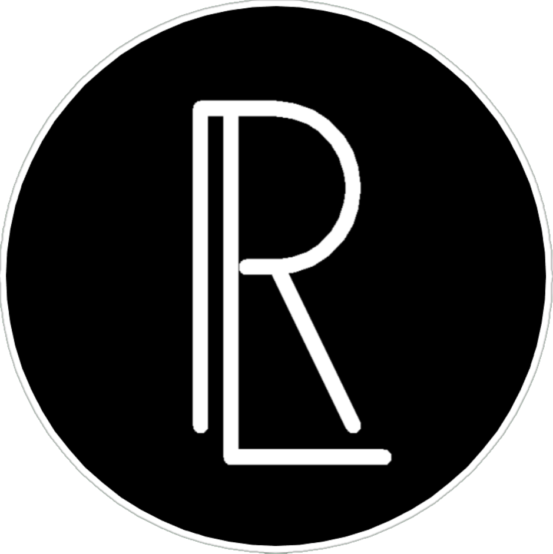
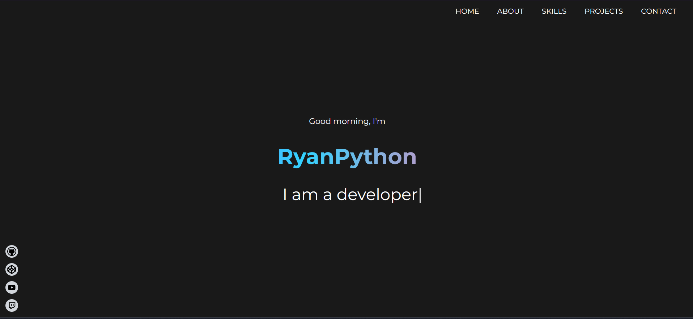

    
    <h1>ryanpython.me</h1>
    
The 3rd iteration of Ryan's personal website

    
    
    
    
    
    

 

    

---

## 📝 About

This is the third iteration of my personal website.

Previous iterations: [v1](https://liyunze-coding.github.io/old-portfolio), [v2](https://liyunze-coding.github.io/old-portfolio-2)

## 🚨 Forking this repo

If you want to fork this repo, feel free to do so. However, I ask that you please give me credit by linking back to my website - https://ryanpython.me . Thanks!

## 📚 License

This project is licensed under the MIT License - see the [LICENSE](./LICENSE) file for details.

<!-- socials -->

## 📱 Socials

